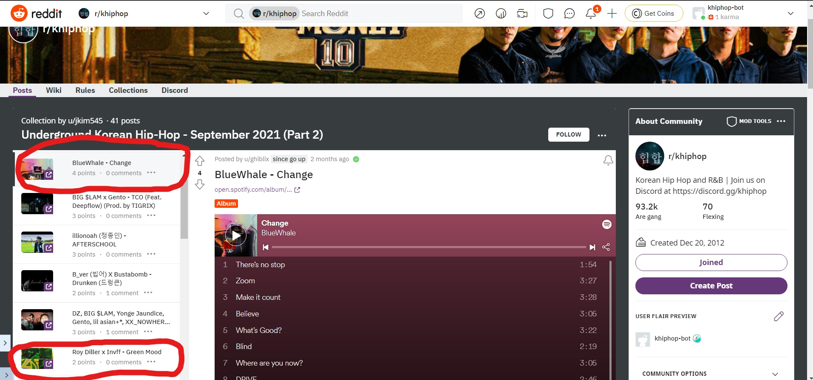

# Sort Single Collection Documentation

## Description

**Author**: Josh Kim

**Date Created**: 11/10/2021

**Date Modified**: N/A

**Purpose**: 

* This script sorts a single r/khiphop collection chronologically so that all the posts are ordered from oldest at the top to newest at the bottom. And, it works regardless of layout type (Standard or Gallery)

* Currently, the only way to reorder a collection is to manually click and drag posts. This is very time consuming especially when a collection can hold up to 100 posts.

* This script can be configured to work in other subreddits and for other collections. 

## Instructions

* See code in ../src/sortSingleCollection.py for more information. 

## Example
As you can see, the two posts below are unordered by their submisison date. The third picture represents the ordered collection after the script.

